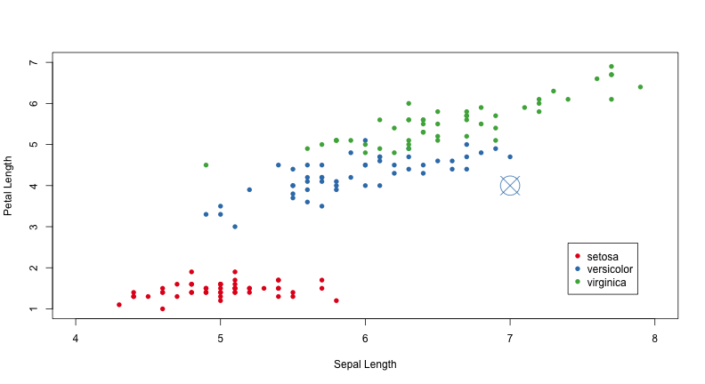
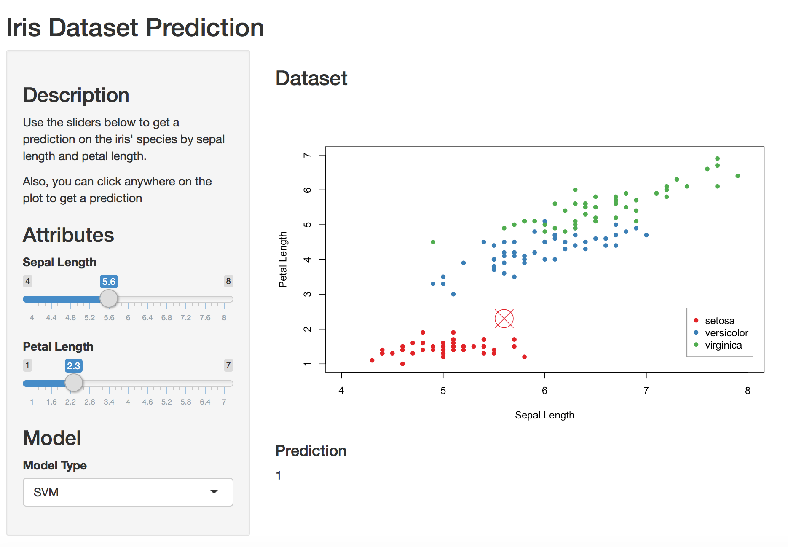

## Project Information

This presentation is part of the final assignment for the
*Developing Data Science* course available on Coursera. It is part of the Data
Science specialization offered by John Hopkins University.

The goal was to develop a Shiny web application to manipulate some data using
predefined UI components, process them in a remote server and display the 
result.

This particular analysis is based on the *Iris* dataset, readily available on
*datasets* package.

--- .class #id 

## Shiny Application

The application lets the user predict the species of a flower based on two 
variables:
* Sepal Length
* Petal Length

More specifically, the user can manipulate two sliders - one for each variable - 
and see the prediction in a plot along with the original data.

The prediction model was built using two different algorithms: SVM and Random
Forest. Their outcome should be one of the following species:
* *setosa*
* *versicolor*
* *virginica*

Alternatively, the user can click on the plot to get a prediction.

--- .class #id 

## Data Visualization

This plot shows the original data, plus a prediction for a flower with sepal 
length of 7 and petal length of 4. Visually, it seems that those two variables 
are enough to predict the outcome with high precision.

--- .class #id 

## Screenshot of the App

